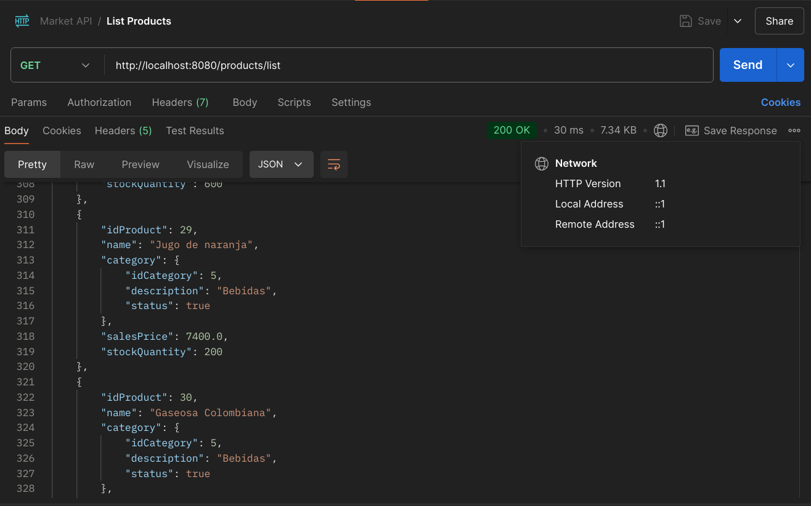
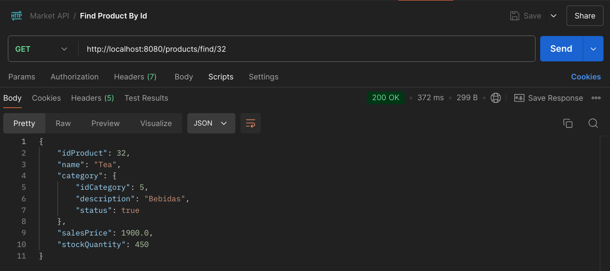

# Market REST API

Este proyecto es una 🛒 API REST diseñada para un supermercado,
que permite la gestión de 👥 clientes, 🛍️ productos y 🛒 compras.

La API fue desarrollada en ☕ Java con 🌿 Spring Boot y utiliza 
PostgreSQL 🐘 como base de datos y Gradle como gestor de 
dependencias. Ofrece funcionalidades como:

- 📋 Ver la lista de productos disponibles
- 🔍 Buscar productos por categoría, stock o ID
- ➕ Crear y ❌ eliminar productos

También permite gestionar las compras:

- 🛒 Obtener las compras realizadas
- 🔍 Buscar compras por ID de cliente o compra
- ➕ Crear y ❌ eliminar compras

El proyecto sigue una arquitectura orientada al dominio y
aplica patrones de diseño como DAO y Repository. Además, 
utiliza Spring Data JPA para interactuar con la base de datos,
incluyendo métodos personalizados en JPQL.

- Esquema de la base de datos:

- Lista de productos:

- Busqueda de productos por id:

### Seguimiento del proyecto:
1. Creacion del proyecto con Spring Boot.
2. Configuracion del archivo .properties
3. Creacion de la estructura del proyecto.
4. Agregar dependencia Spring Data JPA.
5. Crear una base de datos en PostgreSQL.
6. Crear el esquema de la base de datos e insertar datos.
7. Agregar el driver de PostgreSQL.
8. Conectar la aplicacion a la base de datos.
9. Creacion de las entidades en Java utilizando JPA.
10. Crear una entidad con clave primaria compuesta.
11. Creacion de las relaciones entre las tablas.
12. Creacion de los repositorios para interactuar con la base de datos
    mediante JPA.
13. Utilizacion de Query Methods para realizar consultas SQL.
14. Configurar la conexion con la base de datos por medio de variables de entorno.
15. Agregar dependencia "mapstruct" y el plugin para IntelliJ.
16. Crear los mappers que convierten una clase de entidad a una clase de dominio.